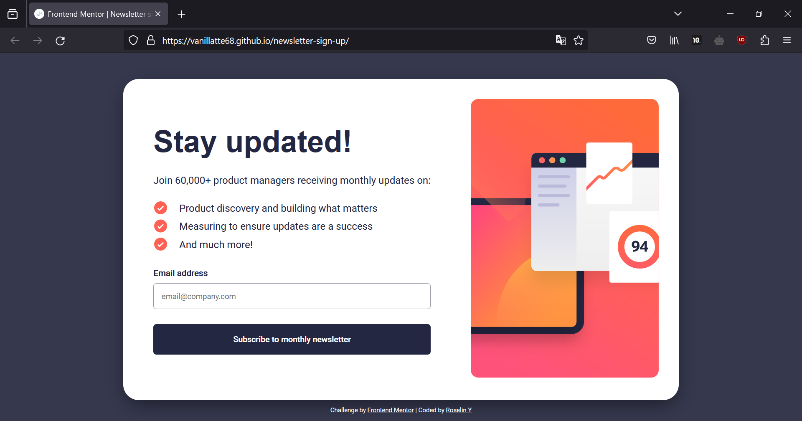

# Frontend Mentor - Newsletter sign-up form with success message solution

This is a solution to the [Newsletter sign-up form with success message challenge on Frontend Mentor](https://www.frontendmentor.io/challenges/newsletter-signup-form-with-success-message-3FC1AZbNrv). Frontend Mentor challenges help you improve your coding skills by building realistic projects.

## Table of contents

- [Overview](#overview)
  - [The challenge](#the-challenge)
  - [Screenshot](#screenshot)
  - [Links](#links)
- [My process](#my-process)
  - [Built with](#built-with)
  - [Useful resources](#useful-resources)
- [Author](#author)

## Overview

### The challenge

Users should be able to:

- Add their email and submit the form
- See a success message with their email after successfully submitting the form
- See form validation messages if:
  - The field is left empty
  - The email address is not formatted correctly
- View the optimal layout for the interface depending on their device's screen size
- See hover and focus states for all interactive elements on the page

### Screenshot

### Links

- Solution URL: [Add solution URL here](https://www.frontendmentor.io/solutions/newsletter-sign-up-form-html-css-javascript-rDKuoc4cwP)
- Live Site URL: [Add live site URL here](https://vanillatte68.github.io/newsletter-sign-up/)

## My process

### Built with

- Semantic HTML5 markup
- CSS custom properties
- Flexbox
- CSS Flex
- Javascript
- Mobile-first workflow

### Useful resources

- [Everything You Need to Know About the Gap After the List Marker ](https://css-tricks.com/everything-you-need-to-know-about-the-gap-after-the-list-marker/) - Article about list marker spacing and customization.
- [Box shadow CSS generator](https://www.cssmatic.com/box-shadow) - For generating CSS box shadow.

## Author

- Frontend Mentor - [Roselin Y](https://www.frontendmentor.io/profile/Vanillatte68)
